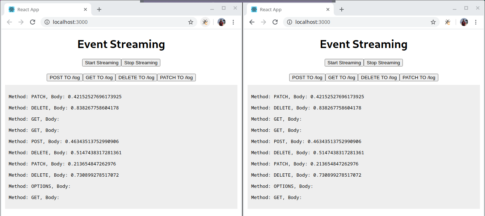

### Server Sent Events using go.

To run server just run: (will run in `5000`  port)
```
go run main.go
```

To run frontend:
```
yarn install
yarn start
```

This will start frontend server in `3000` port. 

After running the frontend. You can send request to server or start or stop streaming by clicking in the button show below in screenshot.




### What it does.
Client sends the request to `/log` endpoint and every subscriber that is listening to the stream channel will receive message from server and frontend just displays the messages received from stream. 

You can directly check streams going to `localhost:5000/sse` which will never finish responding to the events until client closes it. After opening the `/see` you can open another tab to `/log` and see that tab with `/sse` has output. Or, if you use curl you can just do.
```
curl -X GET localhost:5000/log
curl -X POST -d "MY DATA" localhost:5000/log
```
And check how every request that is made to `log` endpoint is streamed to `sse` using ServerSideEvents.

##### To Initialize SSE from JavaScript
```js
var sse = new EventSource("http://localhost:5000/sse")
sse.onmessage = console.log 
```
And to close the EventSource.
```js
sse.close()
```